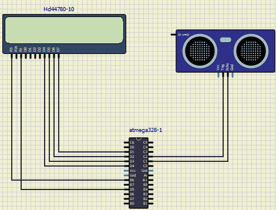
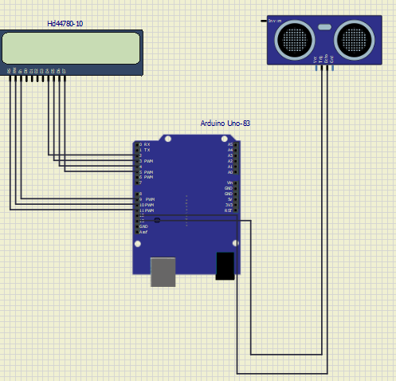

# M2-Embedded_Distance_Measuring_using_UltrasonicSensor
Ultrasonic sensors can measure the distance to a wide range of objects regardless of shape, color or surface texture. They are also able to measure an approaching or receding object. By using “non-contact” ultrasonic sensors, distances can be measured without damage to the object. They’re easy to use and, in many cases, can be used in place of other traditional sensors when the environmental conditions make traditional sensors unusable.
## LCD DISPLAY
### IN ACTION
|OFF|ON|OFF|
|:--:|:--:|:--:|
||||

## CI and Code Quality

|CPP CHECK|CODACY|
|-----:|-----:|
|

## Wiki Documentation
 * Simul IDE
 * Arduino IDE
 * Linux
